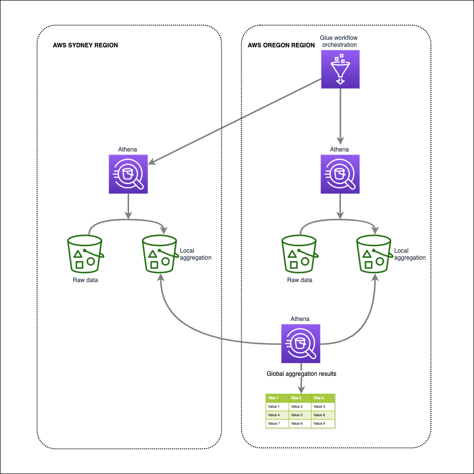
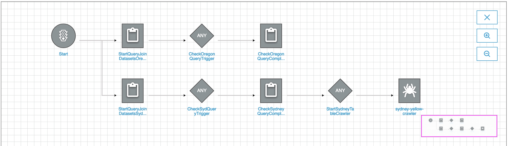
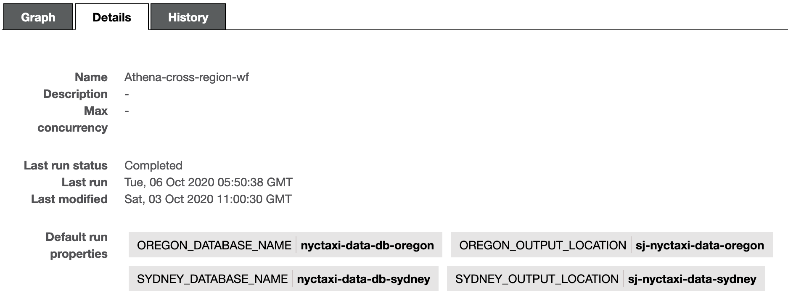

# Athena-cross-region-query
This Glue Workflow based orchestration demonstrates how to run localized Athena in each region and then consolidate results in another region.

It creates Glue catalog tables locally in each region (Sydney and Oregon). Then runs Athena compute locally in each region to create local aggregates - using Athena INSERT INTO statement. Finally, Glue crawler in Oregon creates a table that points to the remote Sydney region's aggregated data. This allows for ad-hoc query to be run within Oregon to create a global aggregation

## Step by step instructions:
1. Create the two Glue catalog tables to store data aggregations locally - use the CTAS statements
2. Create the Glue jobs
3. Create the Glue Workflow as follows:

4. Add the workflow parameters as follows - replace names that match your env

5. Run workflow. After it completes, run an ad-hoc Athena query to create a global aggregate from the local aggregated tables